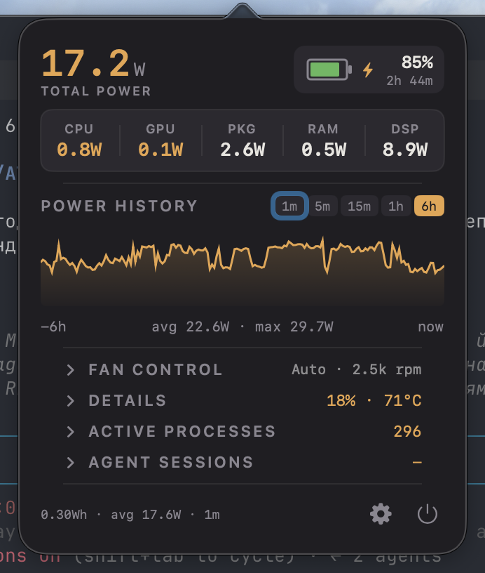

# PowerBarPro

A macOS menu bar app that answers one question at a glance: **where is your
MacBook's energy going right now** — and lets you do something about it.

<p align="center">
  
</p>

## What it does, in plain words

**In the menu bar** you always see the current total power draw (e.g. `17.2W`)
with a thin bar underneath showing how hard the fans are spinning. The bar's
color tells you which fan mode is active: gray for automatic, green/blue/orange
for fixed speeds, rose for the battery-temperature curve.

**Click it** and a compact panel opens:

- **Total power** — big number up top, averaged over a window you choose
  (instant, 3s … 1h), so it doesn't jitter.
- **Battery** — charge %, and how long the battery would last at the current
  draw. The estimate stays visible even when plugged in (a ⚡ bolt marks AC
  power), and it recalculates within a second of pulling the cable.
- **Component strip** — CPU, GPU, package, RAM and display watts side by side.
  Hover any cell for extra detail (fabric power, GPU cores, brightness…).
- **Power History** — a live chart of total draw for the last 1m / 5m / 15m /
  1h / 6h. Hover it to read the exact watts at any moment. History survives
  app restarts, so the 6-hour view is really six hours.
- **Fan Control** — one-tap chips: `Auto · Curve · 0 · 30 · 70 · 100`.
  Fixed speeds pin the fans to a percentage of their range; Curve follows the
  battery temperature along an editable ramp (e.g. 36°C→60% … 39°C→100%).
  Switching modes flashes a small volume-style HUD under the menu bar — the
  same one you get when changing modes with keyboard shortcuts.
- **Details** — CPU and GPU load (0–100%), RAM used, swap, free disk, and the
  hottest temperature per component including the battery pack.
- **Active Processes** — which apps are actually burning your watts. Not just
  CPU time: power is attributed per process from real hardware counters
  (CPU energy, memory, GPU), so the numbers add up to what the machine truly
  draws. Hover a row and hit ✕ to terminate a hog. The list scrolls.
- **Agent Sessions** — for people who run Claude Code / Codex CLI: every live
  session with its project, memory and CPU, plus the memory eaten by their
  MCP helper processes. Reveal a session's folder in Finder or quit it (the
  conversation stays on disk — `--resume` brings it back).
- **Session energy** — the footer shows how many watt-hours the system
  consumed since the app started, with the average draw.
- **Alerts** — optional notification when a single app draws more than a
  threshold (10–60W) for five minutes straight.
- **Settings** — behind the gear: averaging windows, refresh rate, alerts,
  launch at login. Every row has an ⓘ with a plain-language explanation.

Right-clicking the menu bar item gives a classic NSMenu with the same
controls, process list and a language switch (English / Ukrainian).

## What it costs to run

Almost nothing: ~0.1% CPU and ~45 MB of memory at idle. Expensive work
(process scanning, battery probing, UI rendering) runs only while something
is actually visible, and slows to a crawl in the background.

## Requirements

- macOS 13.0+, Apple Silicon
- **[macpow](https://github.com/k06a/macpow)** — power metrics provider:
  ```bash
  brew install k06a/tap/macpow
  ```
  Without it the app falls back to [macmon](https://github.com/vladkens/macmon)
  (`brew install macmon`) with a reduced metric set.
- **Fan control is optional** and appears only when the
  [MacFans](https://github.com/AlexSerbinov) daemon (`macfansd`) is installed —
  writing SMC fan keys needs a root helper, and PowerBarPro talks to it over
  its local socket instead of asking for privileges itself. Everything else
  works without it.

## Install

```bash
git clone https://github.com/AlexSerbinov/PowerBarPro.git
cd PowerBarPro
make install   # builds release, creates /Applications/PowerBarPro.app
open /Applications/PowerBarPro.app
```

Other targets: `make build`, `make test`, `make run`, `make restart`, `make clean`.

## Calibration (optional)

Raw per-process energy counters undercount real impact (they miss DRAM, GPU
and fabric). The bundled Python tooling measures an app's true cost by
kill-and-diff against a quiet baseline and stores per-app correction factors:

```bash
python3 Scripts/calibrate.py "Telegram"
python3 Scripts/calibrate_overnight.py    # batch mode
```

## Architecture

Clean Architecture + MVVM + Combine, protocol-oriented DI throughout;
`DependencyContainer` is the only composition root. 331 unit tests: `swift test`.

```
App           main.swift, AppDelegate, DependencyContainer
Presentation  MenuBarManager, MenuBuilder, PopoverManager, FanHUD, ViewModels
Services      MacPowService, ProcessEnergyService, PowerAttributionEngine,
              AgentSessionsService, MacFansClient, CalibrationService, ...
Core          Protocols + Models (SystemMetrics, AttributedPower, ...)
```

## License

MIT — see [LICENSE](LICENSE).
